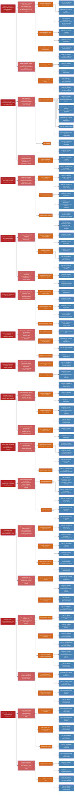

# Hospitality Threat Library

```mermaid
---
config:
  layout: elk
  flowchart:
    curve: step
---
flowchart LR
  T0("Exfiltrate Guest and Employee Records from<br/>Hotel Management Platforms"):::threat
  T0M0["Exfiltrate guest personal and payment data<br/>from centralized hotel management platforms<br/>for identity theft, fraud, or resale"]:::motive
  T0 --> T0M0
  T0M0C0("Property Management System (PMS)"):::component
  T0M0 --> T0M0C0
  T0M0C0W0("CWE-798: Use of Hard-coded Credentials"):::cwe
  T0M0C0 --> T0M0C0W0
  T0M0C0W1("CWE-308: Use of Single-factor<br/>Authentication"):::cwe
  T0M0C0 --> T0M0C0W1
  T0M0C0W2("CWE-89: Improper Neutralization of<br/>Special Elements used in an SQL Command<br/>('SQL Injection')"):::cwe
  T0M0C0 --> T0M0C0W2
  T0M0C1("Hotel Management SaaS Platform"):::component
  T0M0 --> T0M0C1
  T0M0C1W0("CWE-522: Insufficiently Protected<br/>Credentials"):::cwe
  T0M0C1 --> T0M0C1W0
  T0M0C1W1("CWE-285: Improper Authorization"):::cwe
  T0M0C1 --> T0M0C1W1
  T0M0C2("Central Reservations System (CRS)"):::component
  T0M0 --> T0M0C2
  T0M0C2W0("CWE-798: Use of Hard-coded Credentials"):::cwe
  T0M0C2 --> T0M0C2W0
  T0M0C2W1("CWE-732: Incorrect Permission Assignment<br/>for Critical Resource"):::cwe
  T0M0C2 --> T0M0C2W1
  T0M1["Extract employee PII and loyalty member<br/>records in bulk for resale or targeted<br/>identity fraud campaigns"]:::motive
  T0 --> T0M1
  T0M1C0("Loyalty Program Platform"):::component
  T0M1 --> T0M1C0
  T0M1C0W0("CWE-287: Improper Authentication"):::cwe
  T0M1C0 --> T0M1C0W0
  T0M1C0W1("CWE-285: Improper Authorization"):::cwe
  T0M1C0 --> T0M1C0W1
  T0M1C1("Enterprise HR / ERP System"):::component
  T0M1 --> T0M1C1
  T0M1C1W0("CWE-1104: Use of Unmaintained Third<br/>Party Components"):::cwe
  T0M1C1 --> T0M1C1W0
  T0M1C1W1("CWE-732: Incorrect Permission Assignment<br/>for Critical Resource"):::cwe
  T0M1C1 --> T0M1C1W1
  T1("Compromise Guest Accounts to Commit Loyalty<br/>and Booking Fraud"):::threat
  T1M0["Drain loyalty point balances and book<br/>unauthorized free stays using compromised<br/>guest accounts"]:::motive
  T1 --> T1M0
  T1M0C0("Guest Authentication Layer"):::component
  T1M0 --> T1M0C0
  T1M0C0W0("CWE-307: Improper Restriction of<br/>Excessive Authentication Attempts"):::cwe
  T1M0C0 --> T1M0C0W0
  T1M0C0W1("CWE-640: Weak Password Recovery<br/>Mechanism for Forgotten Password"):::cwe
  T1M0C0 --> T1M0C0W1
  T1M0C0W2("CWE-308: Use of Single-factor<br/>Authentication"):::cwe
  T1M0C0 --> T1M0C0W2
  T1M0C0W3("CWE-384: Session Fixation"):::cwe
  T1M0C0 --> T1M0C0W3
  T1M0C0W4("CWE-294: Authentication Bypass by<br/>Capture-replay"):::cwe
  T1M0C0 --> T1M0C0W4
  T1M0C1("API Gateway"):::component
  T1M0 --> T1M0C1
  T1M0C1W0("CWE-522: Insufficiently Protected<br/>Credentials"):::cwe
  T1M0C1 --> T1M0C1W0
  T1M0C1W1("CWE-285: Improper Authorization"):::cwe
  T1M0C1 --> T1M0C1W1
  T1M1["Harvest and resell compromised loyalty<br/>credentials and hotel extranet access in<br/>underground markets"]:::motive
  T1 --> T1M1
  T1M1C0("Hotel Extranet and Channel Manager"):::component
  T1M1 --> T1M1C0
  T1M1C0W0("CWE-522: Insufficiently Protected<br/>Credentials"):::cwe
  T1M1C0 --> T1M1C0W0
  T1M1C0W1("CWE-601: URL Redirection to Untrusted<br/>Site ('Open Redirect')"):::cwe
  T1M1C0 --> T1M1C0W1
  T2("Skim Payment Card Data from Hotel POS and<br/>Payment Infrastructure"):::threat
  T2M0["Install card-skimming malware on POS<br/>infrastructure to harvest bulk payment card<br/>data for resale or fraud"]:::motive
  T2 --> T2M0
  T2M0C0("Point of Sale (POS) Terminal"):::component
  T2M0 --> T2M0C0
  T2M0C0W0("CWE-312: Cleartext Storage of Sensitive<br/>Information"):::cwe
  T2M0C0 --> T2M0C0W0
  T2M0C0W1("CWE-494: Download of Code Without<br/>Integrity Check"):::cwe
  T2M0C0 --> T2M0C0W1
  T2M0C1("POS Back-Office System"):::component
  T2M0 --> T2M0C1
  T2M0C1W0("CWE-287: Improper Authentication"):::cwe
  T2M0C1 --> T2M0C1W0
  T2M0C1W1("CWE-923: Improper Restriction of<br/>Communication Channel to Intended<br/>Endpoints"):::cwe
  T2M0C1 --> T2M0C1W1
  T2M0C2("Online Ordering Platform"):::component
  T2M0 --> T2M0C2
  T2M0C2W0("CWE-829: Inclusion of Functionality from<br/>Untrusted Control Sphere"):::cwe
  T2M0C2 --> T2M0C2W0
  T2M0C2W1("CWE-79: Improper Neutralization of Input<br/>During Web Page Generation ('Cross-site<br/>Scripting')"):::cwe
  T2M0C2 --> T2M0C2W1
  T3("Manipulate Hotel Billing and Payment Systems<br/>for Financial Gain"):::threat
  T3M0["Falsify guest billing records and divert<br/>payments for direct financial gain"]:::motive
  T3 --> T3M0
  T3M0C0("Property Management System (PMS)"):::component
  T3M0 --> T3M0C0
  T3M0C0W0("CWE-269: Improper Privilege Management"):::cwe
  T3M0C0 --> T3M0C0W0
  T3M0C0W1("CWE-285: Improper Authorization"):::cwe
  T3M0C0 --> T3M0C0W1
  T3M0C1("Payment Processing System"):::component
  T3M0 --> T3M0C1
  T3M0C1W0("CWE-285: Improper Authorization"):::cwe
  T3M0C1 --> T3M0C1W0
  T3M0C1W1("CWE-345: Insufficient Verification of<br/>Data Authenticity"):::cwe
  T3M0C1 --> T3M0C1W1
  T3M0C1W2("CWE-352: Cross-Site Request Forgery<br/>(CSRF)"):::cwe
  T3M0C1 --> T3M0C1W2
  T3M1["Exploit insider access to payroll and<br/>scheduling systems for unauthorized<br/>financial benefit"]:::motive
  T3 --> T3M1
  T3M1C0("Employee Payroll and Scheduling System"):::component
  T3M1 --> T3M1C0
  T3M1C0W0("CWE-269: Improper Privilege Management"):::cwe
  T3M1C0 --> T3M1C0W0
  T3M1C0W1("CWE-732: Incorrect Permission Assignment<br/>for Critical Resource"):::cwe
  T3M1C0 --> T3M1C0W1
  T4("Encrypt Hotel Operations for Ransom"):::threat
  T4M0["Encrypt hotel operational systems to extort<br/>ransom payment under threat of sustained<br/>business disruption"]:::motive
  T4 --> T4M0
  T4M0C0("Property Management System (PMS)"):::component
  T4M0 --> T4M0C0
  T4M0C0W0("CWE-287: Improper Authentication"):::cwe
  T4M0C0 --> T4M0C0W0
  T4M0C0W1("CWE-269: Improper Privilege Management"):::cwe
  T4M0C0 --> T4M0C0W1
  T4M0C1("Hotel Management SaaS Platform"):::component
  T4M0 --> T4M0C1
  T4M0C1W0("CWE-285: Improper Authorization"):::cwe
  T4M0C1 --> T4M0C1W0
  T4M0C1W1("CWE-829: Inclusion of Functionality from<br/>Untrusted Control Sphere"):::cwe
  T4M0C1 --> T4M0C1W1
  T4M0C2("Point of Sale (POS) System"):::component
  T4M0 --> T4M0C2
  T4M0C2W0("CWE-494: Download of Code Without<br/>Integrity Check"):::cwe
  T4M0C2 --> T4M0C2W0
  T5("Deceive Hotel Staff into Authorizing<br/>Fraudulent Payments"):::threat
  T5M0["Manipulate hotel finance and operations<br/>staff into executing fraudulent wire<br/>transfers or payment diversions"]:::motive
  T5 --> T5M0
  T5M0C0("Hotel Staff Email System"):::component
  T5M0 --> T5M0C0
  T5M0C0W0("CWE-346: Origin Validation Error"):::cwe
  T5M0C0 --> T5M0C0W0
  T5M0C1("Finance and Accounts Payable System"):::component
  T5M0 --> T5M0C1
  T5M0C1W0("CWE-308: Use of Single-factor<br/>Authentication"):::cwe
  T5M0C1 --> T5M0C1W0
  T5M0C1W1("CWE-346: Origin Validation Error"):::cwe
  T5M0C1 --> T5M0C1W1
  T5M0C2("Help Desk and IT Support"):::component
  T5M0 --> T5M0C2
  T5M0C2W0("CWE-287: Improper Authentication"):::cwe
  T5M0C2 --> T5M0C2W0
  T6("Deny Hotel Operational Availability Through<br/>System Disruption"):::threat
  T6M0["Exhaust hotel system resources to prevent<br/>guest-facing operations and generate<br/>financial losses through booking denial"]:::motive
  T6 --> T6M0
  T6M0C0("Reservation and Booking API"):::component
  T6M0 --> T6M0C0
  T6M0C0W0("CWE-770: Allocation of Resources Without<br/>Limits or Throttling"):::cwe
  T6M0C0 --> T6M0C0W0
  T6M0C1("IoT Network Infrastructure"):::component
  T6M0 --> T6M0C1
  T6M0C1W0("CWE-923: Improper Restriction of<br/>Communication Channel to Intended<br/>Endpoints"):::cwe
  T6M0C1 --> T6M0C1W0
  T6M0C1W1("CWE-494: Download of Code Without<br/>Integrity Check"):::cwe
  T6M0C1 --> T6M0C1W1
  T7("Endanger Guests by Compromising Hotel<br/>Physical Safety Systems"):::threat
  T7M0["Gain unauthorized physical access to hotel<br/>spaces by subverting electronic lock and<br/>access control systems"]:::motive
  T7 --> T7M0
  T7M0C0("Property Management System (PMS)"):::component
  T7M0 --> T7M0C0
  T7M0C0W0("CWE-287: Improper Authentication"):::cwe
  T7M0C0 --> T7M0C0W0
  T7M0C0W1("CWE-285: Improper Authorization"):::cwe
  T7M0C0 --> T7M0C0W1
  T7M0C1("Building Management System (BMS)"):::component
  T7M0 --> T7M0C1
  T7M0C1W0("CWE-923: Improper Restriction of<br/>Communication Channel to Intended<br/>Endpoints"):::cwe
  T7M0C1 --> T7M0C1W0
  T7M0C1W1("CWE-306: Missing Authentication for<br/>Critical Function"):::cwe
  T7M0C1 --> T7M0C1W1
  T7M1["Create life-safety hazards for guests and<br/>staff by disabling or triggering fire and<br/>emergency systems"]:::motive
  T7 --> T7M1
  T7M1C0("Fire Suppression and Safety System"):::component
  T7M1 --> T7M1C0
  T7M1C0W0("CWE-287: Improper Authentication"):::cwe
  T7M1C0 --> T7M1C0W0
  T7M1C0W1("CWE-285: Improper Authorization"):::cwe
  T7M1C0 --> T7M1C0W1
  T8("Destroy Hotel Operational Records to<br/>Sabotage Business Continuity"):::threat
  T8M0["Permanently destroy hotel operational data<br/>to prevent business recovery and create<br/>maximum financial damage"]:::motive
  T8 --> T8M0
  T8M0C0("Reservation and Property Management Systems"):::component
  T8M0 --> T8M0C0
  T8M0C0W0("CWE-269: Improper Privilege Management"):::cwe
  T8M0C0 --> T8M0C0W0
  T8M0C0W1("CWE-732: Incorrect Permission Assignment<br/>for Critical Resource"):::cwe
  T8M0C0 --> T8M0C0W1
  T8M0C0W2("CWE-352: Cross-Site Request Forgery<br/>(CSRF)"):::cwe
  T8M0C0 --> T8M0C0W2
  T8M0C1("Loyalty Program Platform"):::component
  T8M0 --> T8M0C1
  T8M0C1W0("CWE-472: External Control of Assumed-<br/>Immutable Web Parameter"):::cwe
  T8M0C1 --> T8M0C1W0
  T9("Weaponize Hotel Infrastructure to Damage<br/>Brand Reputation"):::threat
  T9M0["Exploit hotel infrastructure to distribute<br/>malware and phishing content to guests,<br/>triggering public trust damage"]:::motive
  T9 --> T9M0
  T9M0C0("Hotel Web Application"):::component
  T9M0 --> T9M0C0
  T9M0C0W0("CWE-79: Improper Neutralization of Input<br/>During Web Page Generation ('Cross-site<br/>Scripting')"):::cwe
  T9M0C0 --> T9M0C0W0
  T9M0C0W1("CWE-601: URL Redirection to Untrusted<br/>Site ('Open Redirect')"):::cwe
  T9M0C0 --> T9M0C0W1
  T9M0C0W2("CWE-494: Download of Code Without<br/>Integrity Check"):::cwe
  T9M0C0 --> T9M0C0W2
  T9M0C1("Kubernetes Cluster"):::component
  T9M0 --> T9M0C1
  T9M0C1W0("CWE-250: Execution with Unnecessary<br/>Privileges"):::cwe
  T9M0C1 --> T9M0C1W0
  T9M0C1W1("CWE-502: Deserialization of Untrusted<br/>Data"):::cwe
  T9M0C1 --> T9M0C1W1
  T10("Compromise Hotel Technology Suppliers to<br/>Reach Guest Data at Scale"):::threat
  T10M0["Compromise a hospitality platform vendor to<br/>reach every property running that platform<br/>through a single trusted channel"]:::motive
  T10 --> T10M0
  T10M0C0("PMS and CRS Vendor Update Channel"):::component
  T10M0 --> T10M0C0
  T10M0C0W0("CWE-494: Download of Code Without<br/>Integrity Check"):::cwe
  T10M0C0 --> T10M0C0W0
  T10M0C0W1("CWE-347: Improper Verification of<br/>Cryptographic Signature"):::cwe
  T10M0C0 --> T10M0C0W1
  T10M0C1("Vendor Integration Connector"):::component
  T10M0 --> T10M0C1
  T10M0C1W0("CWE-522: Insufficiently Protected<br/>Credentials"):::cwe
  T10M0C1 --> T10M0C1W0
  T10M0C1W1("CWE-285: Improper Authorization"):::cwe
  T10M0C1 --> T10M0C1W1
  T10M0C2("Hotel Software Build and Release Pipeline"):::component
  T10M0 --> T10M0C2
  T10M0C2W0("CWE-829: Inclusion of Functionality from<br/>Untrusted Control Sphere"):::cwe
  T10M0C2 --> T10M0C2W0
  T10M0C2W1("CWE-506: Embedded Malicious Code"):::cwe
  T10M0C2 --> T10M0C2W1
  T10M1["Abuse vendor and managed service provider<br/>remote access to move laterally into hotel<br/>estates"]:::motive
  T10 --> T10M1
  T10M1C0("Vendor Remote Access Channel"):::component
  T10M1 --> T10M1C0
  T10M1C0W0("CWE-308: Use of Single-factor<br/>Authentication"):::cwe
  T10M1C0 --> T10M1C0W0
  T10M1C0W1("CWE-923: Improper Restriction of<br/>Communication Channel to Intended<br/>Endpoints"):::cwe
  T10M1C0 --> T10M1C0W1
  T10M1C1("Third-Party Component Inventory"):::component
  T10M1 --> T10M1C1
  T10M1C1W0("CWE-1104: Use of Unmaintained Third<br/>Party Components"):::cwe
  T10M1C1 --> T10M1C1W0
  T10M1C1W1("CWE-829: Inclusion of Functionality from<br/>Untrusted Control Sphere"):::cwe
  T10M1C1 --> T10M1C1W1
  T11("Intercept Guest Communications on Hotel<br/>Network Infrastructure"):::threat
  T11M0["Capture guest credentials, sessions and<br/>personal data from shared hotel wireless<br/>networks"]:::motive
  T11 --> T11M0
  T11M0C0("Guest Wireless Network"):::component
  T11M0 --> T11M0C0
  T11M0C0W0("CWE-311: Missing Encryption of Sensitive<br/>Data"):::cwe
  T11M0C0 --> T11M0C0W0
  T11M0C0W1("CWE-300: Channel Accessible by Non-<br/>Endpoint"):::cwe
  T11M0C0 --> T11M0C0W1
  T11M0C1("Captive Portal and Guest Onboarding"):::component
  T11M0 --> T11M0C1
  T11M0C1W0("CWE-319: Cleartext Transmission of<br/>Sensitive Information"):::cwe
  T11M0C1 --> T11M0C1W0
  T11M0C1W1("CWE-601: URL Redirection to Untrusted<br/>Site ('Open Redirect')"):::cwe
  T11M0C1 --> T11M0C1W1
  T11M0C2("Guest and Corporate Network Segmentation"):::component
  T11M0 --> T11M0C2
  T11M0C2W0("CWE-923: Improper Restriction of<br/>Communication Channel to Intended<br/>Endpoints"):::cwe
  T11M0C2 --> T11M0C2W0
  T11M0C2W1("CWE-306: Missing Authentication for<br/>Critical Function"):::cwe
  T11M0C2 --> T11M0C2W1
  T11M1["Pivot from the guest wireless network into<br/>hotel corporate and payment systems"]:::motive
  T11 --> T11M1
  T11M1C0("Wireless Controller Management Interface"):::component
  T11M1 --> T11M1C0
  T11M1C0W0("CWE-308: Use of Single-factor<br/>Authentication"):::cwe
  T11M1C0 --> T11M1C0W0
  T11M1C0W1("CWE-15: External Control of System or<br/>Configuration Setting"):::cwe
  T11M1C0 --> T11M1C0W1
  T11M1C1("In-Room Entertainment and Casting System"):::component
  T11M1 --> T11M1C1
  T11M1C1W0("CWE-290: Authentication Bypass by<br/>Spoofing"):::cwe
  T11M1C1 --> T11M1C1W0
  T11M1C1W1("CWE-306: Missing Authentication for<br/>Critical Function"):::cwe
  T11M1C1 --> T11M1C1W1
  T12("Subvert Electronic Room Access and Key<br/>Management"):::threat
  T12M0["Forge, clone or replay electronic room<br/>credentials to gain unauthorised physical<br/>entry"]:::motive
  T12 --> T12M0
  T12M0C0("Electronic Door Lock Controller"):::component
  T12M0 --> T12M0C0
  T12M0C0W0("CWE-294: Authentication Bypass by<br/>Capture-replay"):::cwe
  T12M0C0 --> T12M0C0W0
  T12M0C0W1("CWE-290: Authentication Bypass by<br/>Spoofing"):::cwe
  T12M0C0 --> T12M0C0W1
  T12M0C1("Key Encoder and Credential Issuance Terminal"):::component
  T12M0 --> T12M0C1
  T12M0C1W0("CWE-306: Missing Authentication for<br/>Critical Function"):::cwe
  T12M0C1 --> T12M0C1W0
  T12M0C1W1("CWE-345: Insufficient Verification of<br/>Data Authenticity"):::cwe
  T12M0C1 --> T12M0C1W1
  T12M0C2("Mobile Key Application"):::component
  T12M0 --> T12M0C2
  T12M0C2W0("CWE-522: Insufficiently Protected<br/>Credentials"):::cwe
  T12M0C2 --> T12M0C2W0
  T12M0C2W1("CWE-294: Authentication Bypass by<br/>Capture-replay"):::cwe
  T12M0C2 --> T12M0C2W1
  T12M1["Compromise the lock management server to<br/>issue, revoke or erase room credentials at<br/>scale"]:::motive
  T12 --> T12M1
  T12M1C0("Lock Management Server"):::component
  T12M1 --> T12M1C0
  T12M1C0W0("CWE-285: Improper Authorization"):::cwe
  T12M1C0 --> T12M1C0W0
  T12M1C0W1("CWE-269: Improper Privilege Management"):::cwe
  T12M1C0 --> T12M1C0W1
  T12M1C1("Lock Audit Trail and Access Log"):::component
  T12M1 --> T12M1C1
  T12M1C1W0("CWE-732: Incorrect Permission Assignment<br/>for Critical Resource"):::cwe
  T12M1C1 --> T12M1C1W0
  T12M1C1W1("CWE-306: Missing Authentication for<br/>Critical Function"):::cwe
  T12M1C1 --> T12M1C1W1

  classDef threat fill:firebrick,color:white
  classDef motive fill:indianred,color:white
  classDef component fill:chocolate,color:white
  classDef cwe fill:steelblue,color:white
```

Flowchart generated from [`hospitality.json`](../hospitality.json)
